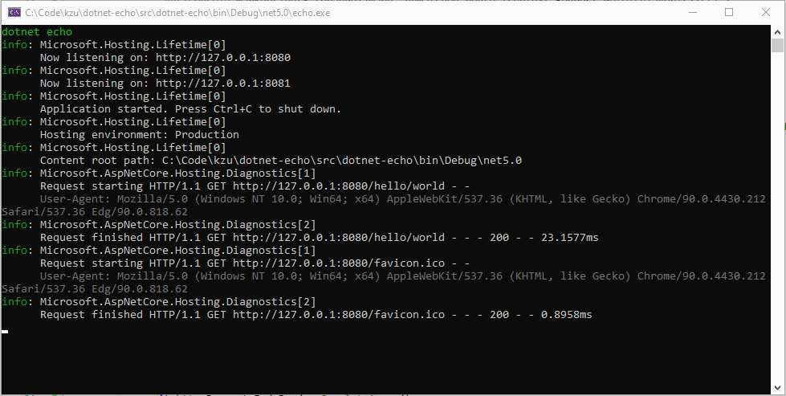
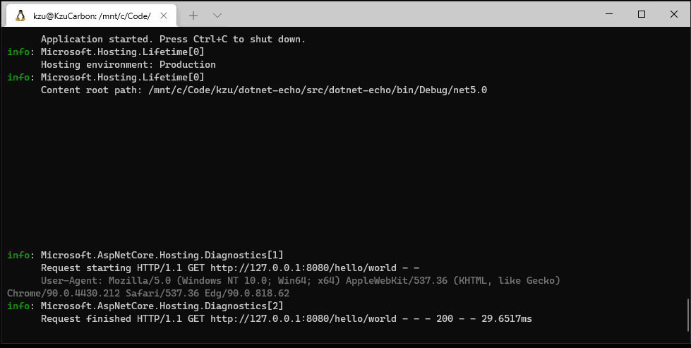

 dotnet-config
============

[](https://www.nuget.org/packages/dotnet-echo)
[](https://www.nuget.org/packages/dotnet-echo)
[](https://github.com/kzu/dotnet-echo/blob/main/LICENSE)
[](https://github.com/kzu/dotnet-file/actions?query=branch%3Amain+workflow%3Abuild+)
[](https://pkg.kzu.io/index.json)

Installing or updating (same command can be used for both):

```
dotnet tool update -g dotnet-echo
```

Usage:

```
> dotnet echo -?
echo
  A trivial program that echoes whatever is sent to it via HTTP.

Usage:
  echo [options]

Options:
  -p, --prefix <prefix>  Prefix to listen on such as http://127.0.0.0:80/ [default: http://*:80/]
  --version              Show version information
  -?, -h, --help         Show help and usage information
```

The program will automatically check for updates once a day and recommend updating 
if there is a new version available.

An example of the output during execution:



And running on Ubuntu:


